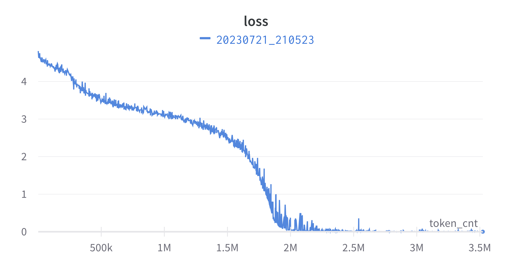
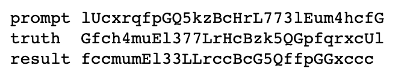

# llm

A minimal implementation of decoder-only transformer in pytorch.

## Features

- model architecture sim. to llama with RMS norm and original RoPe (not rotate half);
- train on single GPU 80GB with automatic mixed precision (amp) and gradient checkpoints;
- no any kind of parallelism for simplicity.

## Prepare Env

```bash
conda create -n llm python=3.10
conda activate llm
cd llm
pip install -r requirements.txt
```

## Train on Toy Reverse Dataset

Train a mini model to reserve a string. See [notebook](toyreverse.ipynb)




## Train on Scifi Novel Dataset

Train a 117M/1.5B base model on ~4000 scifi novels in chinese.

```bash
# Download https://huggingface.co/datasets/wzy816/scifi and and unzip to data/scifi.

# tokenize
python3 -m llm.tokenizer --data_dir=/mnt/llm/data/scifi --model_prefix=/mnt/llm/tokenizer/scifi_16000 --vocab_size=16000

# prepare train dataset
python3 -m llm.dataset --data_dir=/mnt/llm/data/scifi --tokenizer_model_file=/mnt/llm/tokenizer/scifi_16000.model --context_size=1024

# train 117M
python3 -m llm.train --project=llm_scifi --data_dir=/mnt/llm/data/scifi --tokenizer_model_file=/mnt/llm/tokenizer/scifi_16000.model --output_dir=/mnt/llm_scifi --config_file=/mnt/llm/config/scifi_117M.yaml

# train 1.5B
python3 -m llm.train --project=llm_scifi --data_dir=/mnt/llm/data/scifi --tokenizer_model_file=/mnt/llm/tokenizer/scifi_16000.model --output_dir=/mnt/llm_scifi --config_file=/mnt/llm/config/scifi_1.5B.yaml

# train 1.5B from checkpoints
python3 -m llm.train --project=llm_scifi --data_dir=/mnt/llm/data/scifi --tokenizer_model_file=/mnt/llm/tokenizer/scifi_16000.model --checkpoint_dir=/mnt/llm_scifi/step={}_loss={} --output_dir=/mnt/llm_scifi --config_file=/mnt/llm/config/scifi_1.5B.yaml --init_step={}

# inference
python3 -m llm.inference --checkpoint_dir=/mnt/llm_scifi/step={}_loss={} --tokenizer_model_file=/mnt/llm/tokenizer/scifi_16000.model --prompt='在越来越现代的社会里，科学其实是无处不在的，它随时随地与我们日常生活的一切，与我们所有人密切相关' --max_new_tokens=16
# output ,因此,皇帝陛下虽然不复存在,但无法地在故乡的一面留恋

```

## Train on zhwiki Dataset

Train a 2.46B base model on cleaned zhwiki dump data.

```bash
# Download https://huggingface.co/datasets/wzy816/zhwiki_20230701 and unzip to data/zhwiki.

# tokenize
python3 -m llm.tokenizer --data_dir=/mnt/llm/data/zhwiki --model_prefix=/mnt/llm/tokenizer/zhwiki_16000 --vocab_size=16000

# prepare train dataset
python3 -m llm.dataset --data_dir=/mnt/llm/data/zhwiki --tokenizer_model_file=/mnt/llm/tokenizer/zhwiki_16000.model --context_size=1024

# train 2.46B model
python3 -m llm.train --project=llm_zhwiki --data_dir=/mnt/llm/data/zhwiki --tokenizer_model_file=/mnt/llm/tokenizer/zhwiki_16000.model --output_dir=/mnt/llm_zhwiki --config_file=/mnt/llm/config/zhwiki_2.46B.yaml

# inference
python3 -m llm.inference --checkpoint_dir=/mnt/llm_zhwiki/step={}_loss={} --tokenizer_model_file=/mnt/llm/tokenizer/zhwiki_16000.model --prompt='' --max_new_tokens=16

```

## Reference

- [facebook llama](https://github.com/facebookresearch/llama/blob/main/llama/model.py)
- [huggingface llama](https://github.com/huggingface/transformers/blob/main/src/transformers/models/llama/modeling_llama.py)
- [mingpt](https://github.com/karpathy/minGPT/blob/master/mingpt/model.py)
- [llama2.c](https://github.com/karpathy/llama2.c/blob/master/model.py)
- [Chinchilla paper](https://arxiv.org/pdf/2203.15556.pdf)
